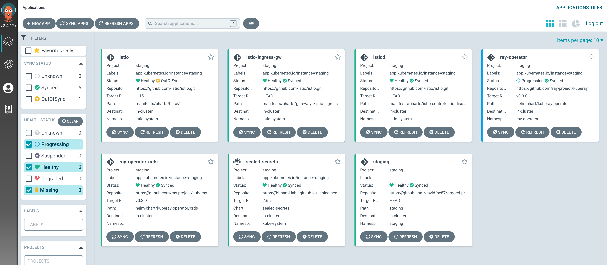
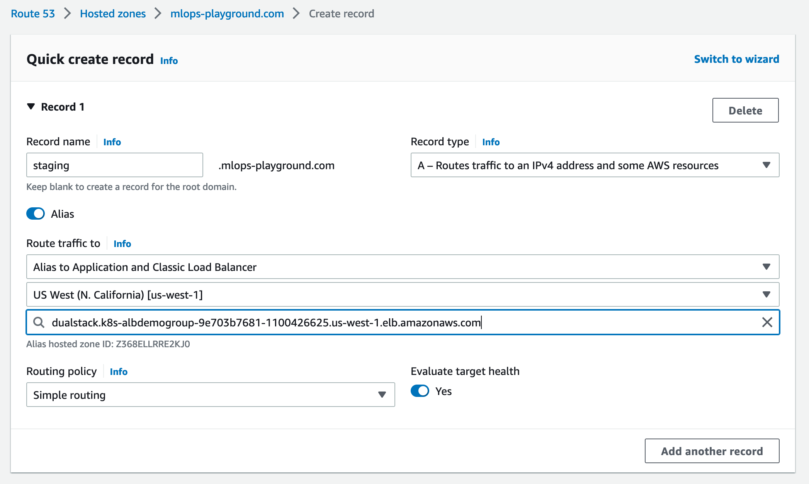

# Your one-stop shop platform for GitOps CI/CD, Machine learning workflows, service mesh and observability

| application   | View  |
| -----------   | ---   |
| Deploy an EKS cluster using Terraform | [README](terraform/infra/README.md) |
| Istio ingress gateway and secure service mesh |  [README](applications/istio-1-15/README.md) |
| Argo CD | [README](applications/argo-cd/README.md) |
| Argo events | [README](applications/argo-events/README.md) |
| Argo workflows | [README](applications/argo-workflows/README.md) |
| Prometheus and Grafana | Installed from Helm charts using Argo CD |
| MLflow | [README](applications/mlflow/README.md) |
| minio artifact storage | [README](applications/minio/README.md) |
| ngrok | [README](applications/ngrok_/README.md) |
| task-tracker app (MERN stack demo) | [README](applications/task-tracker-app/README.md) |
| sealed-secrets | Installed from Helm charts using Argo CD |
| Seldon-core | Installed from Helm charts using Argo CD |
## start local cluster using minikube
kubernetes version has to be less than 1.25 for seldon to work
```
kind create cluster --name kind-cluster --config kind.yaml --wait 5m
```

To delete the cluster:
```
kind delete cluster --name kind-cluster
```


When you run ```kubectl api-versions | grep beta``` you will see that ```autoscaling/v2beta1``` is there and seldon won't complain.

## Use argocd to deploy applications to our Kubernetes cluster 
In a different project folder, clone the repo which has our ArgoCD project and application manifests 
```
git clone git@github.com:davidfox87/argocd-production.git
```
Install projects and apps
```
kubectl apply -f projects.yaml
kubectl apply -f apps.yaml
```

## deploy the secrets in the workflows namespace
Inside ```terraform-argocd/applications/argo-workflows/overlays/workflows/```
```
./deploy_secrets
```

commit and push to github repo so argocd can manage sealedsecrets deployment. You need to add a .env file containing github access token

## wait for everything to sync and be healthy in the argo-cd UI
The following screenshot shows the applications that argocd has deployed into our EKS cluster either from our own kustomize application manifests or third-party helm charts.


## do some admin
create argo-artifacts bucket called ```my-bucket```
create PVC by applying ```applications/argo-workflows/overlays/workflows/models/wine/base/pvc.yaml``` in workflows namespace


## install argocli to submit workflows
```
argo submit -n workflows --watch train.yaml
```

## check the deployment of the REST prediction service
```
kubectl get sdep -n workflows
kubectl -n workflows get sdep seldon-deployment-deploy-wine-clf-hhrxn -o json | jq .status
```

## Send requests to prediction service
Locally we can port-forward to the istio-ingressgateway service and send requests to that:
```
kubectl port-forward -n istio-system svc/istio-ingressgateway 8080:80
```
Send requests to our prediction service
```
curl -X POST      -H 'Content-Type: application/json'  \
    -d '{"data": { "ndarray": [[1,2,3,4,5]]}}'   \
        http://localhost:8080/seldon/workflows/seldon-deployment-deploy-wine-clf-hhrxn/api/v1.0/predictions
        
{"data":{"names":["t:0","t:1","t:2","t:3","t:4"],"ndarray":[[1,2,3,4,5]]},"meta":{"requestPath":{"wine-clf":"foxy7887/wine-model:v10"}}}
```


## look at the stats from the training run in MLFlow repo
```
kubectl port-forward service/mlflow-tracking-server 5555:5000 -n mlflow
http://localhost:5555
```


## apply ingress object
The ingress object has a backend that points to istio-ingressgateway. Apply the object to the istio-system namespace:

```
kubectl apply -f istio-1-15/istio-resources/ingress.yaml -n istio-system
```

The AWS ALB Ingress Controller will create a TargetGroup to be used with the ALB
The Gateway and VirtualService that will configure Envoy of the Istio Ingress Gateway to route traffic to the service of the application.

## Map the domain name that is associated with ACM certificate to the ALB just spawned
Note this should be automated using Crossplane


## Our true GitOps CI/CD platform
Please see MLOps.pdf for a full explanation of this platform and the problems it solves


